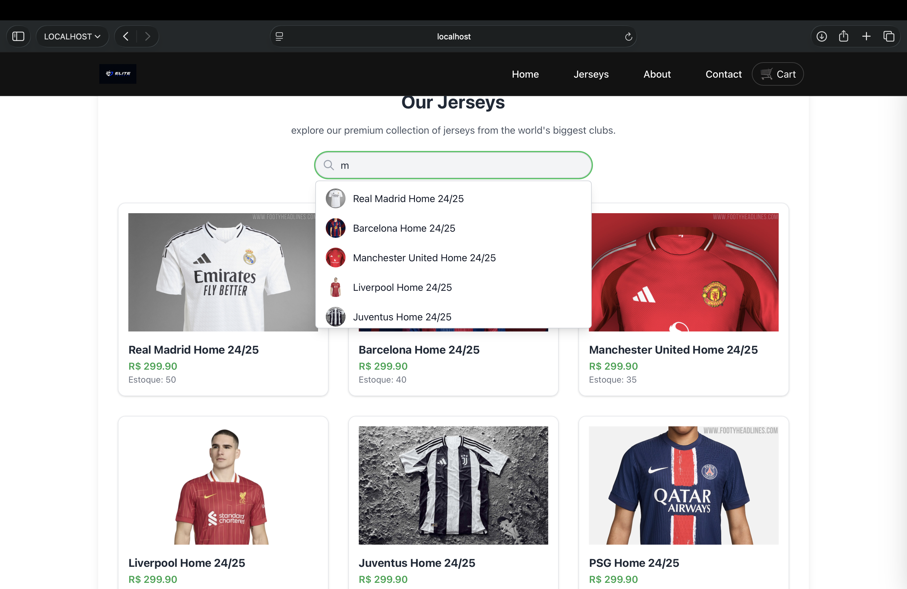
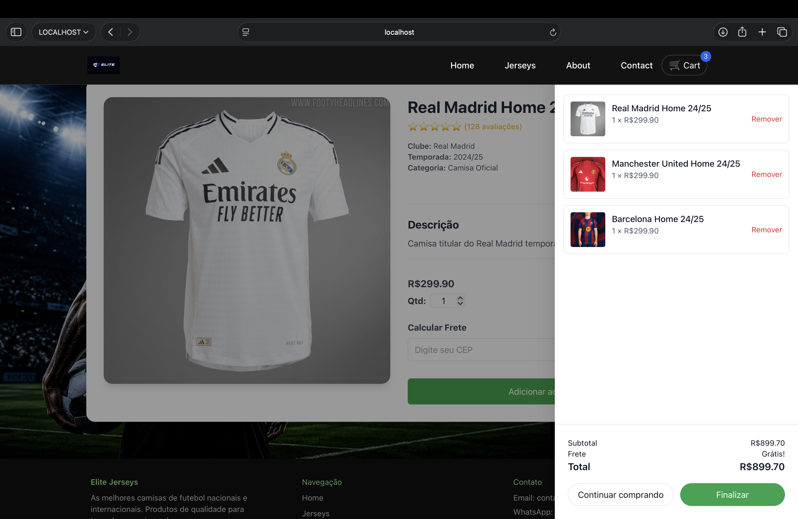
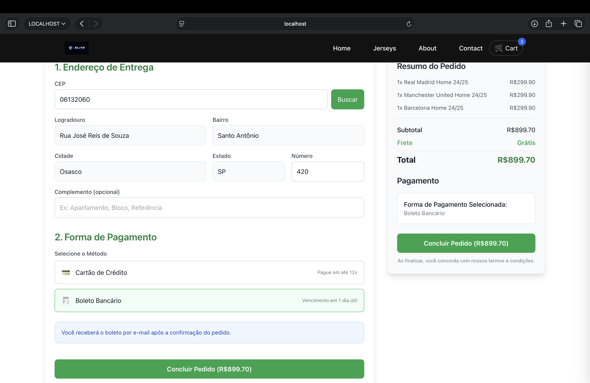
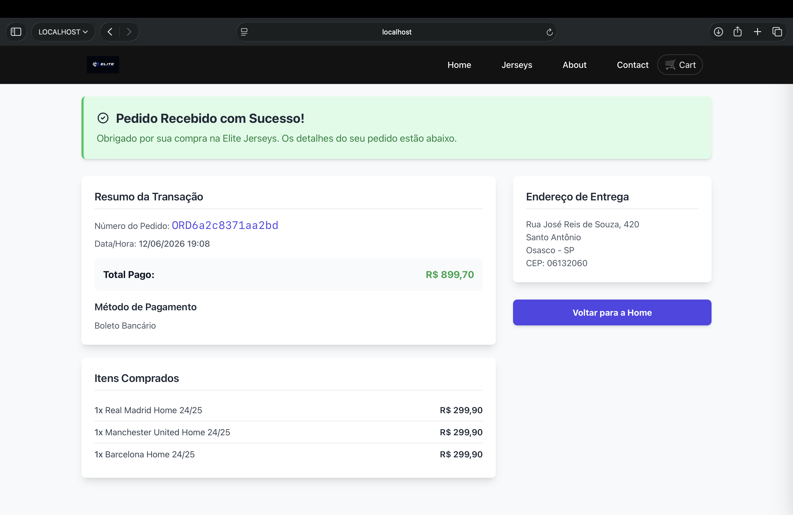

# Elite Jerseys ⚽

Elite Jerseys é uma aplicação full-stack de e-commerce de camisas de futebol desenvolvida com Angular 20, Tailwind CSS, PHP e MySQL.

O projeto simula uma loja virtual completa, permitindo navegação por produtos, visualização de detalhes, gerenciamento de carrinho, cálculo de frete por CEP, checkout e confirmação de pedidos através de integração com API backend.

## 🚀 Tecnologias

* Angular 20
* TypeScript
* Tailwind CSS
* PHP
* MySQL
* Angular Router
* Git & GitHub

## ✨ Funcionalidades

* Catálogo de camisas de futebol
* Página de detalhes do produto
* Carrinho de compras
* Cálculo de frete por CEP
* Checkout completo
* Integração com API PHP
* Persistência de pedidos em MySQL
* Confirmação de pedido
* Layout responsivo
* Navegação SPA com Angular Router

## 📷 Screenshots

### Home


### Product Catalog



### Product Detail


### Shopping Cart



### Checkout



### Order Success



## 🛠️ Instalação

Clone o repositório:

```bash
git clone https://github.com/AbN13/elite-jerseys.git
```

Acesse a pasta:

```bash
cd elite-jerseys
```

Instale as dependências:

```bash
npm install
```

Execute a aplicação Angular:

```bash
ng serve
```

Acesse:

```text
http://localhost:4200
```

## 🗄️ Backend

O projeto inclui uma API em PHP responsável por:

* Listagem de produtos
* Detalhes de produtos
* Busca de CEP
* Processamento de pedidos

Banco de dados:

```text
backend/database/jerseys.sql
```

## 📌 Status

Projeto concluído para fins de estudo e portfólio, demonstrando integração entre Angular, PHP e MySQL em uma aplicação de e-commerce.

## 👨‍💻 Autor

Abner Leandro Gonçalves
